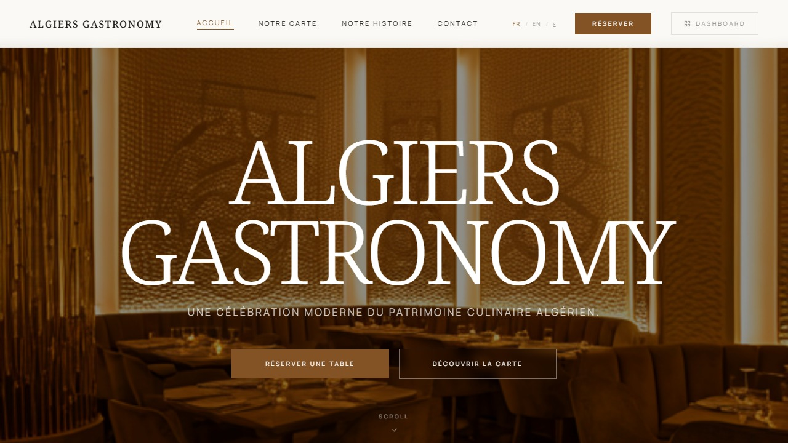

# Algiers Gastronomy — Restaurant Website



> A premium full-stack restaurant website with an integrated admin dashboard — built for a fine dining establishment in Algiers, Algeria.

**Live site:** [restaurant-alger.pages.dev](https://restaurant-alger.pages.dev)

---

## Overview

Algiers Gastronomy is a complete web solution for a high-end Algerian restaurant. It covers the full guest experience — from discovering the menu to booking a table — alongside a powerful back-office for the management team.

The design system *"The Desert Gallery"* draws from Algerian architecture and craftsmanship: terracotta tones, sharp angles, Noto Serif typography.

---

## Features

### Public website
- **Home** — full-screen hero, editorial section, CTA
- **Menu** — scroll-anchored sections, category filters, availability indicator
- **Reservations** — online booking form with time slot and capacity validation
- **Our Story** — editorial page with team members (managed from the admin)
- **Contact** — live data from PocketBase (address, hours, phone, Google Maps)
- **Multilingual** — French / English / Arabic with automatic RTL layout

### Admin dashboard *(tablet + desktop only)*
- **Reservations** — list and monthly calendar views, real-time updates via PocketBase subscriptions, status management (pending / confirmed / cancelled), table assignment
- **Floor plan** — interactive drag-and-drop floor plan (30 tables, 4 sizes), live status (free / reserved / occupied), bottom-sheet detail panel
- **Menu** — full CRUD for categories and items
- **Content** — editorial editor for Hero, Story, Team, CTA sections × 3 languages
- **Contact** — editable contact info, schedules, social links
- **Role-based access** — `admin` (full access) vs `manager` (reservations + floor plan only)

---

## Tech stack

| Layer | Technology |
|---|---|
| Frontend | React 18 + Vite + Tailwind CSS v4 |
| Routing | React Router DOM v6 |
| i18n | i18next + react-i18next (FR / EN / AR + RTL) |
| Backend / DB | PocketBase (self-hosted) |
| Frontend hosting | Cloudflare Pages |
| Backend hosting | Fly.io |
| Drag & drop | react-draggable |

---

## Project structure

```
src/
├── pages/
│   ├── public/          # Home, Menu, Reservation, Contact, Notre Histoire
│   └── admin/           # Reservations, PlanDeSalle, Menu, Contenu, Contact
├── components/
│   ├── layout/          # AdminLayout, PublicLayout, Navbar, Footer
│   └── ui/              # Shared UI components
├── hooks/               # useAuth, useRTL, usePageContenu, useReservationContext
├── lib/                 # pocketbase.js, tables.js
├── i18n/                # Translations (fr / en / ar)
└── context/             # ReservationContext
backend/
├── pb_hooks/            # reservations.pb.js (Resend email hook)
├── pb_migrations/       # DB schema migrations
└── pb_data/             # PocketBase data (not committed)
public/
├── _redirects           # Cloudflare Pages SPA routing
├── robots.txt
└── sitemap.xml
```

---

## Getting started

### Prerequisites
- Node.js 18+
- PocketBase binary ([download](https://pocketbase.io/docs/))

### 1 — Clone and install

```bash
git clone https://github.com/am0nipro01/restaurant-alger.git
cd restaurant-alger
npm install
```

### 2 — Environment variables

```bash
cp .env.example .env
```

Edit `.env`:

```env
VITE_POCKETBASE_URL=http://127.0.0.1:8090
VITE_SITE_URL=http://localhost:5173
```

### 3 — Start PocketBase

```bash
cd backend
./pocketbase serve
```

PocketBase admin UI → [http://127.0.0.1:8090/_/](http://127.0.0.1:8090/_/)

### 4 — Start the frontend

```bash
npm run dev
```

Frontend → [http://localhost:5173](http://localhost:5173)

---

## Deployment

| Service | Purpose | Config |
|---|---|---|
| Cloudflare Pages | Frontend hosting | `public/_redirects` (SPA routing) |
| Fly.io | PocketBase backend | `backend/fly.toml` + `backend/Dockerfile` |

### Environment variables (Cloudflare Pages dashboard)

```
VITE_POCKETBASE_URL = https://your-app.fly.dev
VITE_SITE_URL       = https://your-domain.dz
```

---

## PocketBase collections

| Collection | Description |
|---|---|
| `reservations` | Guest bookings (name, date, time, covers, status, table) |
| `tables` | Floor plan tables (number, capacity, status, position x/y) |
| `menu_categories` | Menu sections with descriptions (FR/EN/AR) |
| `menu_items` | Dishes with price, availability, category |
| `pages_contenu` | Editorial content per page (JSON, 3 languages) |
| `site_config` | Contact info, schedules, social links (key/value JSON) |
| `managers` | Auth collection for restaurant managers |

---

## Admin access

| Role | Access |
|---|---|
| `admin` | Full dashboard (reservations, floor plan, menu, content, contact) |
| `manager` | Reservations + floor plan only |

Login page → `/admin`

---

## SEO

- Meta tags, Open Graph, Twitter Cards on all public pages
- JSON-LD `Restaurant` schema (Schema.org) — auto-updated from `site_config`
- `robots.txt` — allows GPTBot, ClaudeBot, PerplexityBot
- `sitemap.xml` — multilingual with `hreflang` (fr / en / ar)

---

## Roadmap

- [ ] Restaurant name and address (pending owner decision)
- [ ] Domain `.dz` (ANIC registration)
- [ ] Resend email confirmation hook (hook ready — awaiting API key)
- [ ] Real photos (hero, interior, dishes, team)
- [ ] Deploy PocketBase to Fly.io

---

## License

Private project — all rights reserved.
